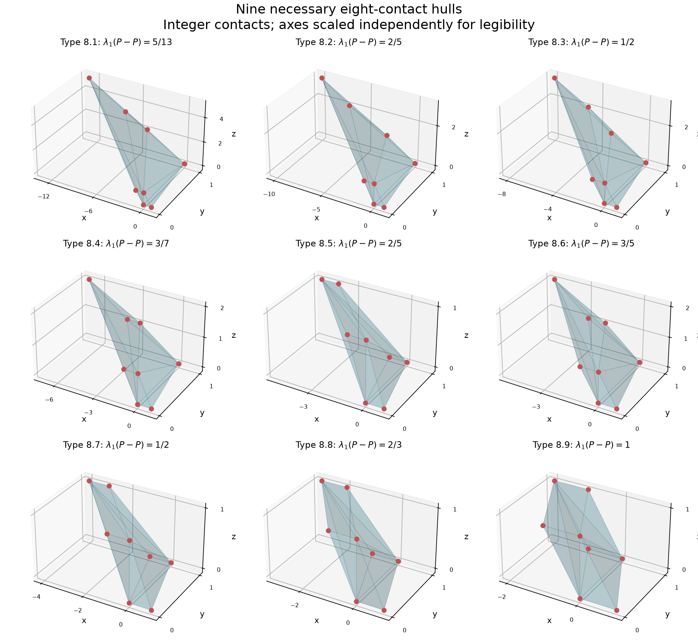
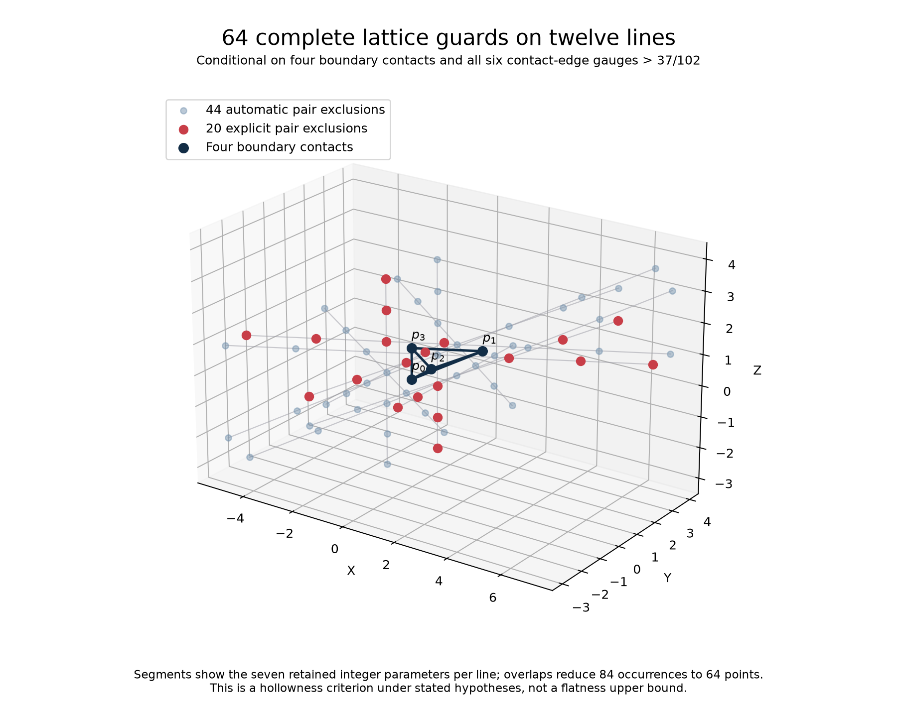
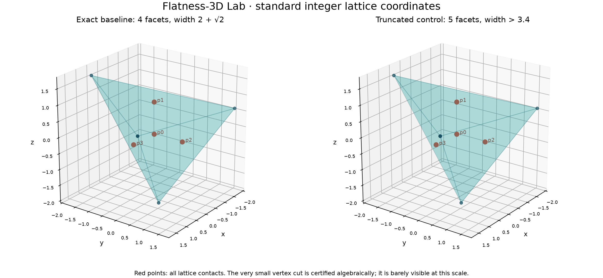
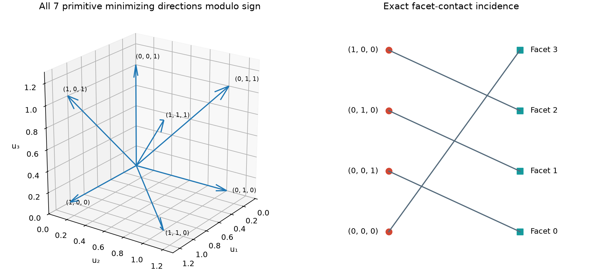

# Flatness-3D Lab

A reproducible research companion on the three-dimensional flatness constant,
hollow convex bodies, lattice contacts and exact width certificates,
maintained by [Njakasoa](https://github.com/Njakasoa).

**Status: exact reproductions and an explicit contact-configuration reduction,
internally reviewed with AI assistance. Novelty remains unconfirmed.
No new global bound, solution of the flatness
conjecture, external peer review or journal/arXiv submission is claimed.**

## Structural result: 63 contact configurations, nine templates

For every compact full-dimensional hollow convex body K in the standard
integer lattice with

```text
w(K) > (11/7)(1 + 2/√3) = 3.385957988881680974…,
```

the internally verified reduction gives a bounded maximal hollow extension M.
Every choice of one lattice point in the relative interior of each facet of M
has a contact hull in **63 explicit necessary affine lattice classes**:
one planar square, ten tetrahedra, and 11, 22, 10 and 9 classes with respectively
five, six, seven and eight vertices. This includes the range w(K) ≥ 2 + √2.
All 63 contact sets embed, by explicit affine unimodular maps, into vertex
subsets of **nine eight-point templates**.

These are necessary possibilities for contact sets, not a classification of
realized high-width bodies. Extra template vertices need not lie in M.
Continuous optimization within the surviving classes remains open.
The general finite-reduction principle is already known from
[Averkov–Codenotti–Macchia–Santos](https://arxiv.org/abs/1907.06199);
the proposed refinement is the sharper planar obstruction and explicit list
at this threshold. Its mathematical priority is not established.

- [Precise claim and scope](claims/CLAIM-0004.md)
- [Planar obstruction](proofs/CONTACT_OBSTRUCTION_REDUCTION.md) and [complete reduction proof](proofs/CONTACT_HULL_FINITE_REDUCTION.md)
- [Nine templates and 63 exact maps](certificates/contact_templates.json)
- [Independent verification](tests/replay_contact_minima_independent.py), [adversarial review](results/CONTACT_REDUCTION_REVIEW.md), and [validation](results/CONTACT_REDUCTION_VALIDATION.md)
- [Novelty audit](proofs/CONTACT_HULL_NOVELTY_AUDIT.md)



## Continuous families: exact witnesses and a finite algebraic model

An exact maximal hollow tetrahedron has precisely four lattice contacts,
whose contact tetrahedron has normalized determinant two, and width

```text
4009295246418 / 1232189371865 = 3.2537979453188001711… > 13/4.
```

Thus width above 13/4 does not force unimodular four-point contacts. The
construction persists in an open parameter neighborhood; no explicit radius
or class optimum is claimed. A companion with six boundary lattice points
has exact width approximately 3.28338262935. Independent rational arithmetic
checks all possible interior points and all potentially minimizing directions
for both witnesses, including deliberate certificate mutations.

- [Four-contact obstruction and proof](proofs/DET2_FOUR_CONTACT_OBSTRUCTION.md), [certificate](certificates/det2_four_contacts.json), and [internal adversarial review](results/DET2_WITNESS_ASTRA_REVIEW.md)
- [Six-contact certificate](certificates/det2_cycle_rational.json) and [independent replay](tests/replay_det2_cycle_independent.py)
- [Finite algebraic model above width 17/5](proofs/DET2_FINITE_ALGEBRAIC_REDUCTION.md): two blocker-permutation branches, 37 complete width directions, and a proved finite lattice-exclusion box
- [Pair-branch exploration](proofs/DET2_PAIR_BRANCH.md), [cube-contact analysis](proofs/CUBE_CONTACT_CLASS.md), and [primary-source notes](references/EIGHT_FACET_RESEARCH_SOURCES.md)

The pair branch now has a formally checked matrix description: a 45-term
rooted-forest determinant expansion identifies its singular boundary, and
16 adjugate identities establish the inverse sign pattern. An independent
implementation checks all equality-boundary patterns, the eight relevant
symmetries and two deliberately corrupted certificates. Positive inverse
column sums remain a separate boundedness condition.

The cubic formulation is now implemented in a column-normalized chart with
eight variables. Exact identities and independently verified pair witnesses
support it. All bounded nonlinear target queries remain **UNKNOWN (timeout)**;
no contact family has been eliminated.

- [Matrix proof](proofs/PAIR_MATRIX_STRUCTURE.md), [exact certificate](certificates/pair_matrix_structure.json), and [independent replay](tests/replay_pair_matrix_independent.py)
- [Column formulation](proofs/PAIR_COLUMN_FORMULATION.md), [exact identities](certificates/pair_column_identities.json), and [encoding review](results/DET2_GAUGE_MODEL_REVIEW.md)

## Complete finite hollowness tests

For an empty lattice contact tetrahedron P of normalized volume d > 1, and
a compact full-dimensional convex body K containing P with all four contact
vertices on its boundary, hollowness can be tested on **at most twelve lattice
lines determined by P**. This specializes known observer and five-point
classification methods; mathematical novelty remains unconfirmed.

If the gauge of K − K on each of the six primitive contact edges exceeds
**37/102**, at most **96 lattice points** suffice for any such P. For
P = conv(0, (2,1,1), (0,1,0), (0,0,1)), the exact list has **64 points**.
In the positive pair-dominant facet chart, 44 exclusions are automatic,
leaving **20 explicit clauses**. All six edge-gauge assumptions are essential
to this finite test. With only the volume bound vol(K) < 21, the larger
1,456-point list applies, leaving 484 pair clauses.

- [Precise statement and limitations — CLAIM-0005](claims/CLAIM-0005.md)
- [Twelve-line proof](proofs/DET2_OBSERVER_LINES.md) and [gauge truncation](proofs/DET2_OBSERVER_GAUGE_GUARDS.md)
- [Exact 64-point certificate](certificates/det2_observer_gauge_guards.json), [independent verifier](tests/replay_det2_gauge_guards_independent.py), and [internal mathematical review](proofs/DET2_OBSERVER_REVIEW.md)

Two independently certified hollow pair witnesses have width > 19/6; one
has precisely four lattice contacts. Two separate nonhollow examples of
width > 7/2 expose the old partial-box screen's missing interior points.
These are controls, not improved flatness bounds. See [the witness proof](proofs/DET2_PAIR_WITNESSES.md).

The complete eight-variable cubic model combines 37 width directions, 20
hollowness clauses and six edge gauges at target 17/5. Its target query timed
out; exact positive and negative pinned controls passed. A separate exact
linear-arithmetic check confirms that the 20 clauses plus six gauges imply
all 484 clauses of the larger model. This does not settle width optimization.



This update exports reviewed scientific source **e84400e**.
See [public-copy validation](PUBLIC_VALIDATION.md) for reproduction evidence.

## Verified baseline

The lab independently reconstructs the Codenotti–Santos tetrahedron in the
standard integer lattice and certifies:

- Lattice width **2 + √2**.
- Volume **2 + (4/3)√2**.
- Exactly four boundary lattice contacts and no interior lattice points.
- Seven primitive minimizing directions up to sign.
- Four affine lattice automorphisms, found by checking all 24 vertex permutations.

The width search has a proved finite coordinate bound. It is not an empirical
search radius. A separate SymPy implementation, importing none of the main
geometry engine, replays the result and rejects ten deliberate mutations.
The planar control certifies the Hurkens witness of width **1 + 2/√3**.

- [Baseline derivation](proofs/BASELINE_RECONSTRUCTION.md) and [exact certificate](certificates/codenotti_santos.json)
- [Complete width/hollowness algorithm](proofs/WIDTH_CERTIFIER.md) and [normalization](NORMALIZATION.md)
- [Independent replay](tests/independent_replay.py) and [planar reconstruction](proofs/FLATNESS_2D_RECONSTRUCTION.md)
- [Adversarial review](results/ADVERSARIAL_REVIEW.md) and [public validation](PUBLIC_VALIDATION.md)



## Known bounds and local optimality

The literature audit found the reference bounds

```text
2 + √2 ≤ Flt(3) ≤ 1 + 2/√3 + 2(3/4)^(1/3) < 3.972.
```

The upper radical expression and its volume consequences are replayed using
exact rational intervals. The local-maximality reconstruction checks the
rank-five gradient system, its three-dimensional kernel and a negative-definite
auxiliary Hessian at the exact parameter c = 1/100. These reproduce known
arguments of Averkov–Codenotti–Macchia–Santos, not new theorems. The published
explicit local-radius computation is not fully replayed.

See the [dated literature audit](STATE_OF_THE_ART.md), [upper-bound proof and
slack](proofs/UPPER_BOUND_SLACK.md), and [local-maximality reconstruction](proofs/LOCAL_MAXIMUM_RECONSTRUCTION.md).
Primary articles are [linked](papers/README.md), not redistributed.

## Finite contact enumeration and exploration

Using the known determinant cutoff for the tetrahedral contact branch, the lab
checks **3,268 ordered HNF candidates**, obtains **239 empty ordered tetrahedra**,
and reduces them to **37 affine-unimodular classes** of determinant at most 17.
The [completeness argument](enumeration/HNF_COMPLETENESS.md) and
[full output](results/empty_contact_tetrahedra.json) concern integer contact
tetrahedra. The structural update extends the complete calculation through
determinant 21: 6,385 ordered candidates, 359 empty ordered tetrahedra and
51 classes before the threshold obstruction is applied. It includes the
coplanar-square and nonsimplicial contact hulls in the finite reduction;
optimization of their surrounding real bodies remains unresolved.

A seeded asymmetric search records **25,265 numerical bodies/iterates**, including
425 directional estimates above 3.4. Iterates are correlated and the contact
families are incomplete. Eight selected reconstructions are rationalized while
preserving lattice contacts, then certified exactly; none exceeds 2 + √2.
The certificates refer to the rationalized bodies, not the original floats.

A separate exact truncation control produces a hollow body with five facets
and width above 3.4. Thus near-extremizer classification must distinguish
arbitrary bodies from maximal extensions. No universality is inferred from
contact signatures prescribed by the search model.

- [Discovery summary](results/discovery_summary.json) and [recorded dataset](results/near_extremizers.jsonl)
- [Eight exact reconstructions](results/certified_discovery_summary.json)
- [Truncation argument](proofs/TRUNCATION_OBSTRUCTION.md) and [certificate](certificates/truncated_delta.json)
- [Remaining degrees of freedom](results/DEGREES_OF_FREEDOM.md), [stop/pivot report](STOP_REPORT.md), and [next steps](NEXT.md)



## Reproduce

Use Python 3.12 from the repository root. No account, API key, proprietary solver
or downloaded third-party paper is required:

```sh
python3 scripts/check_public_snapshot.py
python3 -m venv .venv
.venv/bin/python -m pip install -r requirements.lock
.venv/bin/python reproduce.py
.venv/bin/python reproduce_contact_reduction.py
```

The default replay executes 11 stages: environment checks, exact 3D and 2D
controls, upper-bound arithmetic, local Hessian, contact enumeration, truncation,
independent verification, ten tests, eight exact reconstructions and figures.
Run without Python `-O` or `-OO`, because certificates use assertions.

The separate contact-reduction replay runs eight stages, including complete
enumeration, exact difference minima, all 63 template embeddings, an independent
standard-library verifier with 21 rejected mutations, square controls and figures.
The [public validation receipt](PUBLIC_VALIDATION.md) records both replays.

Replay the new exact witnesses and finite-domain data with the standard library:

```sh
python3 -m experiments.certify_det2_cycle
python3 -m experiments.certify_det2_four_contacts
python3 tests/replay_det2_cycle_independent.py
python3 -m experiments.det2_finite_domain
```

The cycle reconstruction uses the archived numerical search output; rerunning
the floating search is optional. Z3 is also optional and separate from the
baseline dependencies:

```sh
.venv/bin/python -m pip install -r experiments/requirements-smt.txt
.venv/bin/python -m experiments.det2_pair_smt
```

Replay the additional matrix and cubic identities using the baseline dependencies:

```sh
.venv/bin/python -m experiments.pair_matrix_structure
.venv/bin/python tests/replay_pair_matrix_independent.py
.venv/bin/python -m experiments.pair_cubic_width_identities
```

Replay the column identities, pair witnesses and complete observer guards:

```sh
.venv/bin/python reproduce_observer_guards.py
```

This runs nine exact stages, including independent verifiers under Python
`-O`, 44 rejected mutations/substitutions and a strict-endpoint regression.
All six new exact certificate files must reproduce byte for byte. No numerical
search or solver query is run. The complete optional target model is
`experiments.det2_pair_gauge_complete_smt`; its archived outcome is UNKNOWN.

The optional `experiments.det2_adjugate_smt` and
`experiments.det2_pair_structured_smt` modules reproduce the two additional
bounded solver experiments. Their archived results are timeouts, not proofs
of infeasibility.

The core exact geometry uses only the standard library. SymPy supports the
independent checks; SciPy supports exploration; Matplotlib produces figures.
See [environment notes](ENVIRONMENT_AUDIT.md) and [locked dependencies](requirements.lock).
To regenerate the optional floating search as well:

```sh
OPENBLAS_NUM_THREADS=1 .venv/bin/python reproduce.py --discovery
```

Floating solver trajectories can vary across versions and platforms. Replays
refresh timings, environment reports and generated graphics, so check the
archived snapshot hashes **before** replaying. Exact scientific payloads are
compared separately in [PUBLIC_VALIDATION.md](PUBLIC_VALIDATION.md).

## Public snapshot, license and citation

This curated snapshot has a new public Git history. Operational settings,
session instructions, private notes, installed runtimes and third-party paper
copies are excluded. [SOURCE_MANIFEST.json](SOURCE_MANIFEST.json) records the
scientific source revision and hashes of all exported files. Historical reviews
remain dated records; GitHub publication is separately authorized and does not
establish mathematical priority or external peer review.

Project code and technical documentation use the [MIT license](LICENSE),
following the companion labs. See [rights and attribution](publication/RIGHTS.md),
[CITATION.cff](CITATION.cff), [publication record](PUBLICATION.md), and
[novelty log](NOVELTY_LOG.md).

Related laboratories: [Ihara A(2)](https://github.com/Njakasoa/ihara-a2-lab),
[Quantum Max-Cut](https://github.com/Njakasoa/quantum-max-cut-lab),
[Self-Avoiding Walk](https://github.com/Njakasoa/self-avoiding-walk-lab), and
[Tight Knots](https://github.com/Njakasoa/tight-knots-ropelength).
