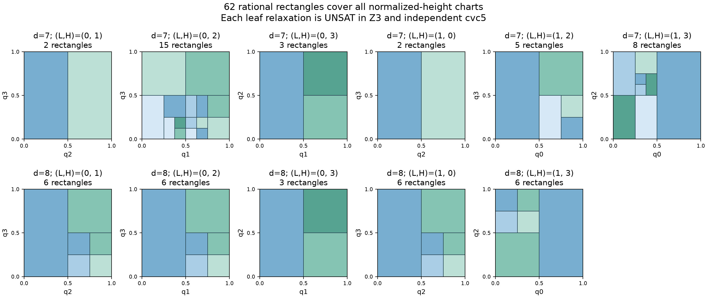

# Flatness-3D Lab

A reproducible research companion on the three-dimensional flatness constant,
hollow convex bodies, lattice contacts and exact width certificates,
maintained by [Njakasoa](https://github.com/Njakasoa).

**Status: exact reproductions, an explicit contact-configuration reduction and
five restricted tetrahedral width bounds,
internally reviewed with AI assistance. Novelty remains unconfirmed.
No new global bound, solution of the flatness
conjecture, external peer review or journal/arXiv submission is claimed.**

## Latest research: determinant orientation and exact horizontal projection

For the remaining contact tetrahedron `P=conv(0,(5,1,2),e2,e3)`, let its
four vertices lie in the relative interiors of the opposite facets of a
hollow real tetrahedron K. Work in the actual Y=(0,1,0) height chart with
normalized minimum at vertex 0 and maximum at vertex 3, allowing ties.
Let F be its column-stochastic contact matrix and A₀=1+2/√3.

[CLAIM-0011](claims/CLAIM-0011.md) proves, in both height orders,

```text
det(F) > 0  implies  w(K) < (5/4)A₀ ≈ 2.693375673.
```

Thus every candidate in this chart with width at least (5/4)A₀ has
negative determinant. The proof also forces the original-label observer
clause `F03 ≥ 3F01+2F02`. This is an analytic convexity argument with
independent internal review; it does not eliminate the entire contact type.

On the surviving negative branch, four horizontal gauge constraints are
piecewise affine in two variables once four base parameters `(p,q,C,E)`
are fixed. Exact strict Farkas certificates eliminate these two variables
from a specified necessary relaxation. An independent Fourier–Motzkin
replay checks all 864 coefficient identities and 384 archived branches.
A feasible projected base is not a sufficient criterion for an actual body.

In the forward height order, analytic identities reduce twelve gauge-piece
selections to four. A closed four-parameter box is then excluded at global
width >17/5, with every other admissible parameter left free:

```text
p ∈ [0,1/32],       q ∈ [31/64,33/64],
C ∈ [3/64,5/64],    E ∈ [31/64,33/64].
```

The polynomial bound is `1−q+(1−pq)E/2+2(B−A) ≤ 3597/2048 < 183/100`,
where `A=C+pE` and `B=qC+E`. The proof and independent review include
strict endpoints. Its parameter volume is 1/1048576; this is not a
physical volume or a fraction of all remaining bodies. The height enclosure
alone is not an excluded rectangle: the C,E bounds are essential.

The **58 necessary contact types** and the global flatness bound remain
unchanged. The reverse order and the remaining continuous domain are open.
The earlier interval-compiler experiment contributes one additional CPC
refutation, freshly checked by Ethos; its SAT controls remain outer
relaxations and the full nonlinear UNKNOWN records remain unresolved.

- [Determinant theorem and forced observer](proofs/DET5_FORCED_OBSERVER_BRANCH.md), [independent review](proofs/DET5_FORCED_OBSERVER_INDEPENDENT_REVIEW.md)
- [Exact horizontal projection and strict certificate audit](proofs/DET5_STRICT_HORIZONTAL_PROJECTION_REVIEW.md)
- [Four-base cuts and branch reduction](proofs/DET5_FOUR_BASE_SHAPE_CUTS.md)
- [Exact middle-gauge subsystem projection](proofs/DET5_FORWARD_MIDDLE_GAUGE_EXACT_PROJECTION.md)
- [Continuous box proof](proofs/DET5_PROJECTED_BASE_BOX.md), [independent review](proofs/DET5_PROJECTED_BASE_BOX_INDEPENDENT_REVIEW.md)
- [Reproduce this update](reproduce_det5_projection.py), [validation](PUBLIC_VALIDATION.md), [French summary](results/FINAL_SUMMARY.md)

## Earlier research: quantitative height separation and exact linear fibers

For the remaining contact tetrahedron P=conv(0,(5,1,2),e2,e3), assume
its four vertices lie in the relative interiors of the opposite facets of
a hollow real tetrahedron K. Normalize actual Y=(0,1,0) vertex heights to
q0=0 and q3=1, allowing tied extrema. Set x=min(q1,q2), y=max(q1,q2),
L=(y-x)/(y(1-x)) and A=1+2/√3. The ordering lemma gives x<y.

The new analytic result proves

```text
w(K) < (500/317)A ≈ 3.3985812908190087 < 17/5
```

whenever q1<q2 and L≤49/1500, or q1>q2 and L≤249/1700.
These closed height bands follow from two lattice-point exclusions and the
known ACMS gauge inequality. No initial large-width assumption is needed.
The [precise statement and proof](claims/CLAIM-0010.md) include the more
general bounds depending on L and distinguish both height orders.

The contact geometry also reduces exactly to six bounded shape parameters
and two remaining variables. At each fixed rational shape, projective
scaling makes the full target a Boolean combination of rational linear
constraints. An independent replay checks 158 symbolic identities; the
implemented fiber compiler has exact positive and negative controls.
**A continuous cover of the six-dimensional shape domain remains open.**

A separate CPC refutation, freshly checked by Ethos, excludes global width
>17/5 throughout q1∈[0,1/256], q2∈[31/256,33/256]. This rectangle has
area 1/32768 and lies outside the earlier certified Y rectangles and the
new analytic bands. Its 84-assertion encoding is independently audited.
A second checked refutation concerns the fixed heights q1=0, q2=1/8.
These are partial region exclusions, not additional eliminated contact types.

The weaker ten-gauge model has an exact hollow witness with Y-width
2048/593>17/5 but full lattice width only 218301984/89395343≈2.442.
It fails the strengthened gauge assumptions. The two complete nonlinear
order models remain UNKNOWN under their archived time limits.
The **58 necessary contact types** and the global flatness bound are unchanged.

- [Bounded coordinates and analytic proof](proofs/DET5_COMPACT_SHAPE_CHART_REVIEW.md)
- [Linear-fiber theorem](proofs/DET5_HORIZONTAL_FIBER_REVIEW.md) and [compiler audit](proofs/DET5_FIBER_ORACLE_INDEPENDENT_REVIEW.md)
- [Continuous rectangle and independent review](proofs/DET5_STRONG_ANCHOR_RECTANGLE_REVIEW.md)
- [Exact weak-model witness](proofs/DET5_QUADRATIC_CHART_ACTUAL_WITNESS.md)
- [Combined residual queue](proofs/DET5_COMBINED_RESIDUAL_QUEUE.md): 258 retained entries, 70 refined; no nonemptiness claim
- [Independent claim review](proofs/DET5_CLAIM0010_INDEPENDENT_REVIEW.md)
- [Limits of continuous interval lifting](proofs/DET5_HORIZONTAL_FIBER_INTERVAL_LIFTING.md)

## Earlier height-region bounds and exact contact ordering

For P=conv(0,(5,1,2),e2,e3), let K=conv(v0,v1,v2,v3) be a hollow real
tetrahedron with each prescribed p_i in the relative interior of the facet
opposite v_i. In these coordinates put Y=(0,1,0),
q_i=(Y(v_i)-min_j Y(v_j))/width(K,Y), and A=1+2/√3.
When q0=0 and q3=1, the following bounds hold for the full lattice width:

| Actual normalized heights | Certified bound for w(K) |
|---|---|
| q1,q2 in [3/5,1] | (102/65)A ≈ 3.3812223833 |
| q1,q2 in [3/4,1] | (23/19)A ≈ 2.6083217044 |

All endpoints are included. Y need not minimize the width, and no preliminary
large-width assumption is required. These results concern the specified
height regions; the full contact class and the global conjecture remain open.
The necessary list still has **58 types** at width at least 2+√2.

Three new original CPC refutations and their three smaller dependency slices
have reference-bound Ethos checks. The reduced statements have 60, 49 and
51 assumptions. Removing the unused upper bound on 1/width(K,Y) strengthens
the conclusion on the entire [3/5,1]² square. Its excluded area outside the
old certified Y rectangles is exactly 3/40 in this coordinate chart.

An exact geometric lemma on the whole Y[0,3] chart gives q1≠q2 and places the
common Y height of p0,p3 strictly between those of v1,v2. It fixes the signs
in the Z-gauge and gives one linear formula for each height order. The
corresponding planar section is a quadrilateral with the two contacts on
adjacent edges.

The frozen 953-query archive still records 259 pending boxes. A separate exact
queue now has **258 residual entries**, retaining strict complements and all
prior U bounds. Six new linear relaxations are SAT, but reconstructing their
actual tetrahedra gives different Y extrema and Y-width below 17/5. They are
not counterexamples in the requested chart. The two models restoring all six
exact products remain **UNKNOWN** after their recorded time limits.

- [Theorem and precise hypotheses — CLAIM-0009](claims/CLAIM-0009.md)
- [Checked reduced proofs](proofs/DET5_CORNER_PROOF_SLICES.md) and [original supplement](proofs/DET5_Y_CORNER_SHARP_SUPPLEMENT.md)
- [Height-ordering lemma](proofs/DET5_Y_CORNER_ANALYTIC_PROBE.md) and [ordered-model audit](proofs/DET5_Y_ORDERED_PRODUCT_COUPLING.md)
- [Exact residual queue](proofs/DET5_ENLARGED_RESIDUAL_QUEUE.md) and [actual-body checks](results/det5_ordered_actual_matrices.json)
- [Reproduce this update](reproduce_det5_corner.py), [public validation](PUBLIC_VALIDATION.md), and [French summary](results/FINAL_SUMMARY.md)

## Established result: three further contact classes excluded

For a compact full-dimensional hollow **real tetrahedron** K with one
prescribed lattice point in the relative interior of each of its four facets,
the following full contact hulls force **w(K) ≤ 17/5 = 3.4**:

| Contact hull, up to affine lattice equivalence | Complete proof cover |
|---|---|
| conv(0, (5,1,1), e2, e3) | Five full height squares |
| conv(0, (7,1,2), e2, e3) | Six charts, part of the 62-rectangle cover |
| conv(0, (8,1,3), e2, e3) | Five charts, part of the 62-rectangle cover |

Each linear relaxation has a separately encoded cvc5 refutation, checked
by the external Ethos proof checker with its assumptions bound to the archived
input. These three class exclusions use **67 checked refutations**. The geometry-to-formula
arguments and symmetry coverage have independent internal reviews.
External software checking is not external human peer review.

Together with the two analytic containment bounds below, this reduces the
original list of 63 necessary configurations to **58 at width at least
2 + √2**: five tetrahedral types, 52 larger spatial contact hulls and the
planar square. The list above the original lower threshold remains 62.
The contact hypothesis is essential: larger surrounding polytopes are not
excluded just because they contain one of these tetrahedra.

- [Determinant-five theorem — CLAIM-0008](claims/CLAIM-0008.md), [certification](proofs/DET5_CLASS4_CERTIFICATION.md), [geometric review](proofs/DET5_HEIGHT_REVIEW.md), and [priority audit](proofs/DET5_CLASS4_LITERATURE.md)
- [Determinant-seven/eight theorem — CLAIM-0007](claims/CLAIM-0007.md), [proof](proofs/HEIGHT_RANK_AND_VOLUME.md), [independent review](proofs/HEIGHT_RANK_REVIEW.md), and [priority audit](proofs/HEIGHT_EXCLUSION_LITERATURE.md)
- [External-checker setup and trust boundary](proofs/HEIGHT_ETHOS_REPRODUCTION.md)

The other determinant-five class, conv(0,(5,1,2),e2,e3), remains open.
The latest exact witness below shows why a two-direction approach cannot
settle it. The 58-type count and the global bound remain unchanged.

## Earlier result: an exact obstruction to the two-direction model

A certified hollow tetrahedron in a retained normalized contact chart has
Y-width and U-width greater than 17/5, where U=(1,-1,-2). Its full first
minimum of K-K is **211637/541875 ≈ 0.390564**, exceeding even the exact
ACMS necessary gauge threshold. It also meets the stated volume bounds.
Yet its full lattice width is only **about 2.449**, attained in Z.

Thus refining only these two height directions, the target gauge conditions
and those volume bounds cannot establish infeasibility. Three successive
exact witnesses record how the missing constraints were identified. Their
independent rational checks exhaust all potentially relevant lattice points,
width directions and gauge vectors; this is not a floating-point diagnosis.

The campaign is frozen at 953 archived queries: 27 of 36 charts have recorded
complete covers and 259 boxes remain pending. Those partial UNSAT labels
have encoding/frontier audits, not external proof-kernel certification.
They add no class exclusion. The complete scaled formulation now imposes all
fifteen widths and has independent audits of 30 base and 36 transferred
queries. Exact nonlinear targets remain **UNKNOWN** under their archived
time limits; relaxed SAT assignments do not certify actual bodies.

An elementary supporting lemma proves, for nested full-dimensional real
tetrahedra P contained in K and every nonzero real covector u,

```text
width(K,u) / vol(K) ≤ width(P,u) / vol(P).
```

It supplies finite formulation bounds. Its proof has an independent internal
review and a symbolic replay of all 1,536 stochastic partition identities;
mathematical priority is unconfirmed.

- [French results summary](results/FINAL_SUMMARY.md)
- [Decisive witness, exact values and completeness proof](proofs/DET5_FULL_GAUGE_RETAINED_WITNESS.md)
- [First retained witness](proofs/DET5_RETAINED_TWO_DIRECTION_WITNESS.md) and [second retained witness](proofs/DET5_SECOND_RETAINED_WITNESS.md)
- [Containment lemma](proofs/SIMPLEX_WIDTH_VOLUME_MONOTONICITY.md) and [rank/volume-gap bounds](proofs/DET5_VOLUME_GAP_BOUNDS.md)
- [Complete fifteen-direction model](proofs/DET5_COMPLETE_GEOMETRY_REVIEW.md), [research status](proofs/DET5_RESEARCH_STATUS.md), and [next steps](NEXT.md)



## Two tetrahedral containment classes excluded

The internally verified analytic bounds apply to every compact, full-dimensional
hollow **real tetrahedron** K containing an affine unimodular image of the
indicated integer tetrahedron:

| Contained configuration | Certified upper bound for w(K) |
|---|---|
| P13 = conv(0, (13,1,5), e2, e3) | (14 + 26/√3)/9 ≈ 3.2234563332 |
| P10 = conv(0, (10,1,3), e2, e3) | (21 + 40/√3)/13 ≈ 3.3918469821 |

The four contained points need not be boundary contacts. Two short lattice
vectors, their sign patterns, and a stochastic-matrix oscillation estimate
combine with the known ACMS gauge inequality to give these continuous bounds.
The determinant-13 proof has an independent internal mathematical review;
the parameterized extension and both arithmetic applications have independent
exact checks. The bounds are not claimed sharp and external novelty is unconfirmed.

These two analytic bounds alone reduce the original 63 necessary **full facet-contact hulls** to
**62 above (11/7)(1 + 2/√3)** and **61 at width at least 2 + √2**.
At the latter threshold, eight tetrahedral types, 52 spatial hulls with five
to eight contacts, and the planar square remain. Larger contact hulls are
not deleted merely because they contain a P10 or P13 subset: the surrounding
tetrahedron assumption is essential.

- [Exact theorem and scope — CLAIM-0006](claims/CLAIM-0006.md)
- [Determinant-13 proof](proofs/DET13_CONTRACTION_BOUND.md), [parameterized argument](proofs/TWO_VECTOR_CONTRACTION.md), and [internal review](proofs/DET13_CONTRACTION_REVIEW.md)
- [Exact certificate](certificates/det13_contraction.json), [independent replay](tests/replay_det13_contraction_independent.py), and [primary-source novelty audit](proofs/DET13_CONTRACTION_LITERATURE.md)
- [All nine nonunimodular guard lists](certificates/nonunimodular_observer_guards.json) and [independent guard verifier](tests/replay_nonunimodular_guards_independent.py)

An exact weighted refinement checks 123 candidates across 41 separating
vector pairs. It gives the determinant-eight bound (13 + 24/√3)/7 ≈ 3.8366294943,
which removes no further class. Two exactly hollow counterexamples disprove
a proposed total-leakage shortcut. The earlier complete determinant-seven/eight
cubic targets remain archived as **UNKNOWN (timeout)**. The later height-cover
proofs above exclude these contact classes independently of those queries.
See [weighted bounds and counterexamples](proofs/WEIGHTED_CONTRACTION_AND_TRACE_LIMIT.md)
and [complete models with encoding audit](proofs/NONUNIMODULAR_COMPLETE_MODELS.md).

## Original structural reduction: 63 configurations, nine templates

For every compact full-dimensional hollow convex body K in the standard
integer lattice with

```text
w(K) > (11/7)(1 + 2/√3) = 3.385957988881680974…,
```

the internally verified reduction gives a bounded maximal hollow extension M.
Every choice of one lattice point in the relative interior of each facet of M
has a contact hull in **63 explicit necessary affine lattice classes**:
one planar square, ten tetrahedra, and 11, 22, 10 and 9 classes with respectively
five, six, seven and eight vertices. This includes the range w(K) ≥ 2 + √2.
All 63 contact sets embed, by explicit affine unimodular maps, into vertex
subsets of **nine eight-point templates**.

These are necessary possibilities for contact sets, not a classification of
realized high-width bodies. Extra template vertices need not lie in M.
Continuous optimization within the surviving classes remains open.
The general finite-reduction principle is already known from
[Averkov–Codenotti–Macchia–Santos](https://arxiv.org/abs/1907.06199);
the proposed refinement is the sharper planar obstruction and explicit list
at this threshold. Its mathematical priority is not established.

- [Precise claim and scope](claims/CLAIM-0004.md)
- [Planar obstruction](proofs/CONTACT_OBSTRUCTION_REDUCTION.md) and [complete reduction proof](proofs/CONTACT_HULL_FINITE_REDUCTION.md)
- [Nine templates and 63 exact maps](certificates/contact_templates.json)
- [Independent verification](tests/replay_contact_minima_independent.py), [adversarial review](results/CONTACT_REDUCTION_REVIEW.md), and [validation](results/CONTACT_REDUCTION_VALIDATION.md)
- [Novelty audit](proofs/CONTACT_HULL_NOVELTY_AUDIT.md)


## Continuous families: exact witnesses and a finite algebraic model

An exact maximal hollow tetrahedron has precisely four lattice contacts,
whose contact tetrahedron has normalized determinant two, and width

```text
4009295246418 / 1232189371865 = 3.2537979453188001711… > 13/4.
```

Thus width above 13/4 does not force unimodular four-point contacts. The
construction persists in an open parameter neighborhood; no explicit radius
or class optimum is claimed. A companion with six boundary lattice points
has exact width approximately 3.28338262935. Independent rational arithmetic
checks all possible interior points and all potentially minimizing directions
for both witnesses, including deliberate certificate mutations.

- [Four-contact obstruction and proof](proofs/DET2_FOUR_CONTACT_OBSTRUCTION.md), [certificate](certificates/det2_four_contacts.json), and [internal adversarial review](results/DET2_WITNESS_ASTRA_REVIEW.md)
- [Six-contact certificate](certificates/det2_cycle_rational.json) and [independent replay](tests/replay_det2_cycle_independent.py)
- [Finite algebraic model above width 17/5](proofs/DET2_FINITE_ALGEBRAIC_REDUCTION.md): two blocker-permutation branches, 37 complete width directions, and a proved finite lattice-exclusion box
- [Pair-branch exploration](proofs/DET2_PAIR_BRANCH.md), [cube-contact analysis](proofs/CUBE_CONTACT_CLASS.md), and [primary-source notes](references/EIGHT_FACET_RESEARCH_SOURCES.md)

The pair branch now has a formally checked matrix description: a 45-term
rooted-forest determinant expansion identifies its singular boundary, and
16 adjugate identities establish the inverse sign pattern. An independent
implementation checks all equality-boundary patterns, the eight relevant
symmetries and two deliberately corrupted certificates. Positive inverse
column sums remain a separate boundedness condition.

The cubic formulation is now implemented in a column-normalized chart with
eight variables. Exact identities and independently verified pair witnesses
support it. All bounded nonlinear target queries remain **UNKNOWN (timeout)**;
these queries establish no contact-family exclusion.

- [Matrix proof](proofs/PAIR_MATRIX_STRUCTURE.md), [exact certificate](certificates/pair_matrix_structure.json), and [independent replay](tests/replay_pair_matrix_independent.py)
- [Column formulation](proofs/PAIR_COLUMN_FORMULATION.md), [exact identities](certificates/pair_column_identities.json), and [encoding review](results/DET2_GAUGE_MODEL_REVIEW.md)

## Complete finite hollowness tests

For an empty lattice contact tetrahedron P of normalized volume d > 1, and
a compact full-dimensional convex body K containing P with all four contact
vertices on its boundary, hollowness can be tested on **at most twelve lattice
lines determined by P**. This specializes known observer and five-point
classification methods; mathematical novelty remains unconfirmed.

If the gauge of K − K on each of the six primitive contact edges exceeds
**37/102**, at most **96 lattice points** suffice for any such P. For
P = conv(0, (2,1,1), (0,1,0), (0,0,1)), the exact list has **64 points**.
In the positive pair-dominant facet chart, 44 exclusions are automatic,
leaving **20 explicit clauses**. All six edge-gauge assumptions are essential
to this finite test. With only the volume bound vol(K) < 21, the larger
1,456-point list applies, leaving 484 pair clauses.

- [Precise statement and limitations — CLAIM-0005](claims/CLAIM-0005.md)
- [Twelve-line proof](proofs/DET2_OBSERVER_LINES.md) and [gauge truncation](proofs/DET2_OBSERVER_GAUGE_GUARDS.md)
- [Exact 64-point certificate](certificates/det2_observer_gauge_guards.json), [independent verifier](tests/replay_det2_gauge_guards_independent.py), and [internal mathematical review](proofs/DET2_OBSERVER_REVIEW.md)

Two independently certified hollow pair witnesses have width > 19/6; one
has precisely four lattice contacts. Two separate nonhollow examples of
width > 7/2 expose the old partial-box screen's missing interior points.
These are controls, not improved flatness bounds. See [the witness proof](proofs/DET2_PAIR_WITNESSES.md).

The complete eight-variable cubic model combines 37 width directions, 20
hollowness clauses and six edge gauges at target 17/5. Its target query timed
out; exact positive and negative pinned controls passed. A separate exact
linear-arithmetic check confirms that the 20 clauses plus six gauges imply
all 484 clauses of the larger model. This does not settle width optimization.


This update exports the quantitative height bands, exact linear fibers, checked partial rectangle and their reproducible evidence.
Its exact revision is recorded in SOURCE_MANIFEST.json; partial experiments are
labelled explicitly and are not counted as proofs.
See [public-copy validation](PUBLIC_VALIDATION.md) for reproduction evidence.

## Verified baseline

The lab independently reconstructs the Codenotti–Santos tetrahedron in the
standard integer lattice and certifies:

- Lattice width **2 + √2**.
- Volume **2 + (4/3)√2**.
- Exactly four boundary lattice contacts and no interior lattice points.
- Seven primitive minimizing directions up to sign.
- Four affine lattice automorphisms, found by checking all 24 vertex permutations.

The width search has a proved finite coordinate bound. It is not an empirical
search radius. A separate SymPy implementation, importing none of the main
geometry engine, replays the result and rejects ten deliberate mutations.
The planar control certifies the Hurkens witness of width **1 + 2/√3**.

- [Baseline derivation](proofs/BASELINE_RECONSTRUCTION.md) and [exact certificate](certificates/codenotti_santos.json)
- [Complete width/hollowness algorithm](proofs/WIDTH_CERTIFIER.md) and [normalization](NORMALIZATION.md)
- [Independent replay](tests/independent_replay.py) and [planar reconstruction](proofs/FLATNESS_2D_RECONSTRUCTION.md)
- [Adversarial review](results/ADVERSARIAL_REVIEW.md) and [public validation](PUBLIC_VALIDATION.md)


## Known bounds and local optimality

The literature audit found the reference bounds

```text
2 + √2 ≤ Flt(3) ≤ 1 + 2/√3 + 2(3/4)^(1/3) < 3.972.
```

The upper radical expression and its volume consequences are replayed using
exact rational intervals. The local-maximality reconstruction checks the
rank-five gradient system, its three-dimensional kernel and a negative-definite
auxiliary Hessian at the exact parameter c = 1/100. These reproduce known
arguments of Averkov–Codenotti–Macchia–Santos, not new theorems. The published
explicit local-radius computation is not fully replayed.

See the [dated literature audit](STATE_OF_THE_ART.md), [upper-bound proof and
slack](proofs/UPPER_BOUND_SLACK.md), and [local-maximality reconstruction](proofs/LOCAL_MAXIMUM_RECONSTRUCTION.md).
Primary articles are [linked](papers/README.md), not redistributed.

## Finite contact enumeration and exploration

Using the known determinant cutoff for the tetrahedral contact branch, the lab
checks **3,268 ordered HNF candidates**, obtains **239 empty ordered tetrahedra**,
and reduces them to **37 affine-unimodular classes** of determinant at most 17.
The [completeness argument](enumeration/HNF_COMPLETENESS.md) and
[full output](results/empty_contact_tetrahedra.json) concern integer contact
tetrahedra. The structural update extends the complete calculation through
determinant 21: 6,385 ordered candidates, 359 empty ordered tetrahedra and
51 classes before the threshold obstruction is applied. It includes the
coplanar-square and nonsimplicial contact hulls in the finite reduction;
optimization of their surrounding real bodies remains unresolved.

A seeded asymmetric search records **25,265 numerical bodies/iterates**, including
425 directional estimates above 3.4. Iterates are correlated and the contact
families are incomplete. Eight selected reconstructions are rationalized while
preserving lattice contacts, then certified exactly; none exceeds 2 + √2.
The certificates refer to the rationalized bodies, not the original floats.

A separate exact truncation control produces a hollow body with five facets
and width above 3.4. Thus near-extremizer classification must distinguish
arbitrary bodies from maximal extensions. No universality is inferred from
contact signatures prescribed by the search model.

- [Discovery summary](results/discovery_summary.json) and [recorded dataset](results/near_extremizers.jsonl)
- [Eight exact reconstructions](results/certified_discovery_summary.json)
- [Truncation argument](proofs/TRUNCATION_OBSTRUCTION.md) and [certificate](certificates/truncated_delta.json)
- [Remaining degrees of freedom](results/DEGREES_OF_FREEDOM.md), [stop/pivot report](STOP_REPORT.md), and [next steps](NEXT.md)


## Reproduce

Use Python 3.12 from the repository root. No account, API key, proprietary solver
or downloaded third-party paper is required:

```sh
python3 scripts/check_public_snapshot.py
python3 -m venv .venv
.venv/bin/python -m pip install -r requirements.lock
.venv/bin/python reproduce.py
.venv/bin/python reproduce_contact_reduction.py
```

The default replay executes 11 stages: environment checks, exact 3D and 2D
controls, upper-bound arithmetic, local Hessian, contact enumeration, truncation,
independent verification, ten tests, eight exact reconstructions and figures.
Run without Python `-O` or `-OO`, because certificates use assertions.

The separate contact-reduction replay runs eight stages, including complete
enumeration, exact difference minima, all 63 template embeddings, an independent
standard-library verifier with 21 rejected mutations, square controls and figures.
The [public validation receipt](PUBLIC_VALIDATION.md) records both replays.

Replay the new exact witnesses and finite-domain data with the standard library:

```sh
python3 -m experiments.certify_det2_cycle
python3 -m experiments.certify_det2_four_contacts
python3 tests/replay_det2_cycle_independent.py
python3 -m experiments.det2_finite_domain
```

The cycle reconstruction uses the archived numerical search output; rerunning
the floating search is optional. Z3 is also optional and separate from the
baseline dependencies:

```sh
.venv/bin/python -m pip install -r experiments/requirements-smt.txt
.venv/bin/python -m experiments.det2_pair_smt
```

Replay the additional matrix and cubic identities using the baseline dependencies:

```sh
.venv/bin/python -m experiments.pair_matrix_structure
.venv/bin/python tests/replay_pair_matrix_independent.py
.venv/bin/python -m experiments.pair_cubic_width_identities
```

Replay the column identities, pair witnesses and complete observer guards:

```sh
.venv/bin/python reproduce_observer_guards.py
```

This runs nine exact stages, including independent verifiers under Python
`-O`, 44 rejected mutations/substitutions and a strict-endpoint regression.
All six new exact certificate files must reproduce byte for byte. No numerical
search or solver query is run. The complete optional target model is
`experiments.det2_pair_gauge_complete_smt`; its archived outcome is UNKNOWN.

The optional `experiments.det2_adjugate_smt` and
`experiments.det2_pair_structured_smt` modules reproduce the two additional
bounded solver experiments. Their archived results are timeouts, not proofs
of infeasibility.

Replay the new containment bounds and all nine nonunimodular guard lists:

```sh
python3 reproduce_contraction.py
python3 -m experiments.weighted_two_vector_bounds
python3 -O tests/replay_weighted_trace_independent.py
```

The six-stage contraction replay checks three exact payloads byte for byte
and rejects 44 mutations, without a numerical search or solver query. The
weighted/trace checker adds four rejected mutations and independently verifies
full hollowness, lattice width and difference minima for its counterexamples.
With optional Z3 installed, `python3 tests/audit_nonunimodular_encoding.py`
checks the archived cubic encodings without calling the solver.

Replay the three new contact-class exclusions:

```sh
.venv/bin/python -m pip install -r experiments/requirements-smt.txt -r experiments/requirements-cvc5.txt
.venv/bin/python reproduce_height_cover.py
python3 reproduce_det5_class4.py
python3 tests/replay_det5_height_witness_independent.py
```

The first replay checks geometry, all 113 archived encodings, exact coverage
and the 62 proof/input payload bindings without a solver query. The
class-4 default replay uses the standard library to check its archived
proof/input bindings and count certificate. Actual proof-kernel replay
requires the pinned Ethos/cvc5 sources from the [setup guide](proofs/HEIGHT_ETHOS_REPRODUCTION.md).
The public-copy receipt distinguishes fresh kernel checking from hash checks.

Replay the latest model geometry, three retained witnesses and supporting lemmas:

```sh
python3 tests/audit_det5_complete_geometry_independent.py
python3 tests/replay_det5_retained_witness_independent.py
python3 tests/replay_det5_second_retained_witness_independent.py
python3 tests/replay_det5_full_gauge_retained_independent.py
python3 tests/replay_det5_volume_gap_bounds.py
python3 tests/replay_simplex_width_volume_partition.py
```

These use exact rational or symbolic arithmetic without a solver. The optional
encoding audits need Z3 and run no satisfiability queries:

```sh
.venv/bin/python tests/audit_det5_vertex_lift_independent.py
.venv/bin/python tests/audit_det5_joint_round2_independent.py
.venv/bin/python tests/audit_det5_joint_enrichment_independent.py
```

See [the incremental validation record](PUBLIC_VALIDATION.md) for the remaining
new-query audit and the distinction between formula checking and proof checking.

Replay the latest conditional bounds and partial certificates:

```sh
python3 reproduce_det5_partial.py
.venv/bin/python reproduce_det5_partial.py --encodings
```

The default performs three standard-library exact audits, including all 14
independently reconstructed full-matrix inputs. The second command adds six
scaled-encoding, proof-assumption and overlay audits with Z3 and cvc5. Neither runs an
SMT search. To freshly check all **16 additional archived CPC proofs**, use
pinned checker sources from the setup guide:

```sh
.venv/bin/python reproduce_det5_partial.py --encodings \
  --ethos ETHOS/build/src/ethos --ethos-source ETHOS \
  --cvc5-source CVC5
```

These comprise twelve old Y rectangles, two uniform-gauge corner proofs,
the original scaled-box proof and its 69-assumption slice. They are overlapping
partial certificates, not sixteen additional excluded contact classes.
The wrapper refreshes audit receipts but leaves all archived solver inputs,
proof payloads and original proof-check receipts unchanged.

Replay the stronger corner bounds, exact ordering, residual queues and new
archived models without running any SMT search:

```sh
python3 reproduce_det5_corner.py
.venv/bin/python reproduce_det5_corner.py --encodings
```

The default runs ten exact audits/reconstructions with the standard library.
The optional encoding audits require the pinned solver Python packages.
To freshly check the three new original proofs and their three reduced
statements, use the same pinned external checker setup:

```sh
.venv/bin/python reproduce_det5_corner.py --encodings \
  --ethos ETHOS/build/src/ethos --ethos-source ETHOS \
  --cvc5-source CVC5
```

The six refutations concern overlapping height regions, not six excluded
contact classes. Default proof bindings are distinct from fresh kernel checks.
The wrapper preserves archived scientific files and proof receipts; it writes
its own public validation receipt.

The core exact geometry uses only the standard library. SymPy supports the
independent checks; SciPy supports exploration; Matplotlib produces figures.
See [environment notes](ENVIRONMENT_AUDIT.md) and [locked dependencies](requirements.lock).
To regenerate the optional floating search as well:

```sh
OPENBLAS_NUM_THREADS=1 .venv/bin/python reproduce.py --discovery
```

Floating solver trajectories can vary across versions and platforms. Replays
refresh timings, environment reports and generated graphics, so check the
archived snapshot hashes **before** replaying. Exact scientific payloads are
compared separately in [PUBLIC_VALIDATION.md](PUBLIC_VALIDATION.md).

## Reproduce the height bands and linear fibers

```sh
.venv/bin/python reproduce_det5_fiber.py
.venv/bin/python reproduce_det5_fiber.py --encodings
```

The default uses SymPy and Z3 for seven exact symbolic, witness, arithmetic
and queue checks. Install the baseline dependencies and optional solver packages
first; encoding and external-proof checks also require cvc5:

```sh
.venv/bin/python -m pip install -r requirements.lock \
  -r experiments/requirements-smt.txt -r experiments/requirements-cvc5.txt
```
No SMT search is run. Primary articles are linked rather than redistributed;
the public arithmetic replay does not repeat the archived primary-text review.
To freshly check both new CPC proofs with the pinned external setup:

```sh
.venv/bin/python reproduce_det5_fiber.py --encodings \
  --ethos ETHOS/build/src/ethos --ethos-source ETHOS \
  --cvc5-source CVC5
```

All archived scientific inputs, certificates and original receipts are restored
after each check. The wrapper writes a separate public validation receipt.
The partial rectangle and the fixed-height refutation do not certify the
remaining continuous shape domain.

## Reproduce the orientation and projection update

After installing the dependencies above, run:

```sh
.venv/bin/python reproduce_det5_projection.py
.venv/bin/python reproduce_det5_projection.py --encodings
```

The default runs nine exact checks with SymPy. The optional formula audits
also use Z3 and cvc5. No SMT search is run. Strict inequalities, degenerate
Farkas circuits and a deliberately corrupted certificate are tested.
The public replay skips the unredistributed primary-article text check;
the original literature review is retained as an identified archived record.

For one fresh reference-bound CPC check with the
[pinned external tools](proofs/HEIGHT_ETHOS_REPRODUCTION.md):

```sh
.venv/bin/python reproduce_det5_projection.py --encodings \
  --ethos ETHOS/build/src/ethos --ethos-source ETHOS \
  --cvc5-source CVC5
```

The wrapper preserves original scientific bytes and writes
[its own replay receipt](results/public_det5_projection_validation.json).
Run without Python's `-O`/`-OO` options; checkers require assertions.

## Public snapshot, license and citation

This curated snapshot has a new public Git history. Operational settings,
session instructions, private notes, installed runtimes and third-party paper
copies are excluded. [SOURCE_MANIFEST.json](SOURCE_MANIFEST.json) records the
scientific source revision and hashes of all exported files. Historical reviews
remain dated records; GitHub publication is separately authorized and does not
establish mathematical priority or external peer review.

Project code and technical documentation use the [MIT license](LICENSE),
following the companion labs. See [rights and attribution](publication/RIGHTS.md),
[CITATION.cff](CITATION.cff), [publication record](PUBLICATION.md), and
[novelty log](NOVELTY_LOG.md).

Related laboratories: [Ihara A(2)](https://github.com/Njakasoa/ihara-a2-lab),
[Quantum Max-Cut](https://github.com/Njakasoa/quantum-max-cut-lab),
[Self-Avoiding Walk](https://github.com/Njakasoa/self-avoiding-walk-lab), and
[Tight Knots](https://github.com/Njakasoa/tight-knots-ropelength).
